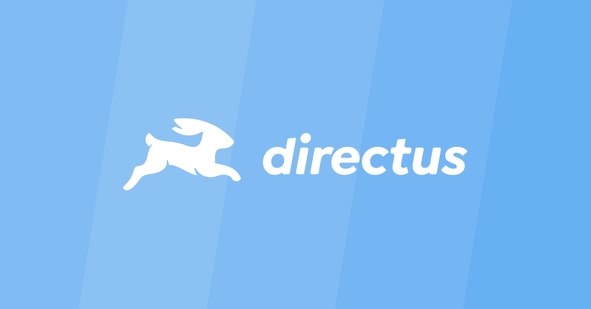

# Awesome Directus 

> A curated list of awesome things related to Directus

[Directus](https://directus.io) is a real-time API and App dashboard for managing SQL database content.

## Contents

- [Official Resources](#official-resources)
- [Integration](#integration)
- [Extensions](#extensions)
- [Tools](#tools)

## Official Resources

- [Documentation](https://docs.directus.io/getting-started/introduction/)
- [GitHub Repository](https://github.com/directus/directus)
- [Live Discussions on Discord](https://directus.chat)
- [Video Tutorials on YouTube](https://www.youtube.com/c/DirectusVideos/featured)

## Integration

- [Offical JS SDK](https://www.npmjs.com/package/@directus/sdk) - The JS SDK provides an intuitive interface for the Directus API from within a JavaScript-powered project (Browsers and Node.js).
- [Offical Gatsby Source Plugin](https://www.npmjs.com/package/@directus/gatsby-source-directus) - Source plugin for pulling data into Gatsby from a Directus API.
- [react-directus](https://github.com/gremo/react-directus) - A set of React components and utilities for Directus Headless CMS.
- [Flutter SDK](https://github.com/workatease/directus9_sdk_flutter) - Flutter SDK to provide interface for Directus API.

## Extensions

- [Editor.js Interface](https://github.com/dimitrov-adrian/directus-extension-editorjs-interface) - Block editor (Editor.js) interface for Directus 9.
- [Draw Interface](https://github.com/jesusgp22/directus-draw-interface) - Free draw interface for directus app.

## Tools

- [migration-tool](https://github.com/directus-community/migration-tool) - Automated script to migrate from Directus v8 to Directus v9.
- [directus-auto-migrate](https://github.com/dstoyanoff/directus-auto-migrate) - A CLI to automatically generate Directus migrations based on the changes in a real instance.

## Contributing

Contributions welcome! Read the [contribution guidelines](contributing.md) first.
